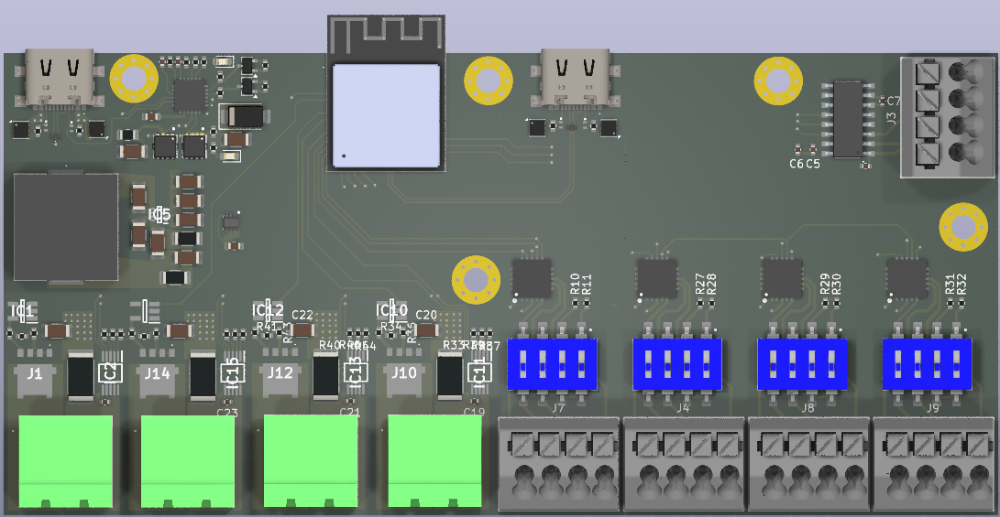

# Afterburner_PCB
PCBA Files
Source Content for Afterburner controller, a temperature control and monitor board. Based of the first design made in easyeda => [afterburner easyeda project](https://oshwlab.com/celestine.s.machuca/afterburner)

# Features

- 4 pt100/1000 sensors with 2/3/4 support
- 4 independant heaters with current measuring and short circuit protection
- 1 LoadCell Amplifier 
- Power input thru USB C pd adapter up to 140w
- USB control with companion app

# Control Interface

For that please refer to [Afterburner Control Software](https://github.com/CelestineOverflow/afterburner)